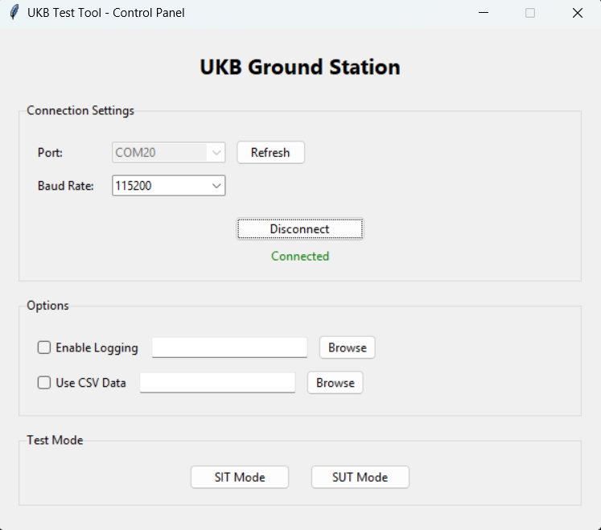
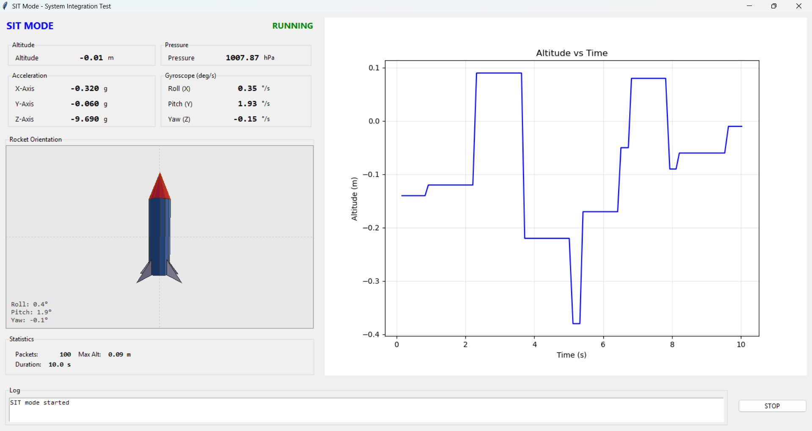
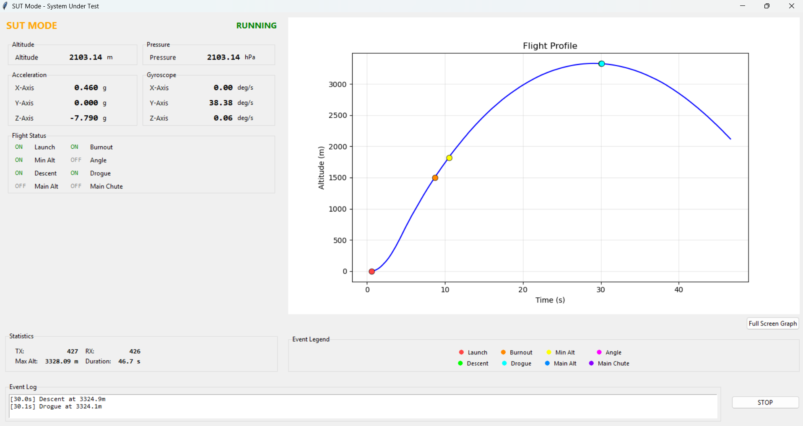

# 🧪 SKYRTOS Test Interface (SIT/SUT)

**Teknofest Roket Yarışması Test ve Doğrulama Sistemi**

Bu klasör, SKYRTOS uçuş bilgisayarının test edilmesi için geliştirilmiş profesyonel bir Ground Station uygulaması içerir. Teknofest yarışmasında hakemlerin sistemimizi test etmesi için tasarlanmıştır.

---

## 📋 İçindekiler

- [Genel Bakış](#-genel-bakış)
- [Test Modları](#-test-modları)
- [Kurulum](#-kurulum)
- [Kullanım](#-kullanım)
- [Uygulama Ekranları](#-uygulama-ekranları)
- [Paket Protokolü](#-paket-protokolü)
- [Dosya Yapısı](#-dosya-yapısı)

---

## 🎯 Genel Bakış

### Amaç

SKYRTOS test sistemi, uçuş bilgisayarının iki farklı senaryoda test edilmesini sağlar:

1. **SIT (Sensor Interface Test)** - Donanım sensör entegrasyonu testi
2. **SUT (System Under Test)** - Yazılım algoritmaları doğrulama testi

Bu testler, Teknofest yarışmasında hakemlerin sisteminizi gerçek uçuş öncesi değerlendirmesi için kullanılır.

### Teknoloji Yığını

- **Backend:** Python 3.8+
- **GUI:** Tkinter
- **Serial:** PySerial
- **Platform:** Windows/Linux/Mac
- **STM32:** FreeRTOS Task-based test handler

---

## 🔬 Test Modları

### 1️⃣ SIT Mode (Sensor Interface Test)

**Amaç:** Fiziksel sensörlerin doğru çalışıp çalışmadığını test etmek.

**Nasıl Çalışır:**
```
STM32 Sensors → Test Mode Task → UART → Ground Station
    ↓                                            ↓
BME280/BMI088                            Real-time Display
```

**Ne Test Eder:**
- ✅ BME280 barometrik sensör okuma
- ✅ BMI088 IMU (accel + gyro) okuma
- ✅ UART iletişim bütünlüğü
- ✅ Sensör kalibrasyon doğruluğu
- ✅ Veri paketleme/parsing

**Kullanım Senaryosu:**
- Fiziksel donanımı test etmek
- Sensör montajını doğrulamak
- Kalibrasyonu kontrol etmek
- Real-time telemetri izlemek

---

### 2️⃣ SUT Mode (System Under Test)

**Amaç:** Uçuş algoritmalarını sentetik verilerle test etmek.

**Nasıl Çalışır:**
```
CSV File → Ground Station → UART → STM32 Algorithms
  ↓              ↓                        ↓
Synthetic   Packet Tx            Flight Detection
 Flight                              ↓
 Data                         Status Bits (Events)
                                    ↓
                              UART → Ground Station
                                    ↓
                              Event Visualization
```

**Ne Test Eder:**
- ✅ Uçuş fazı algılama algoritması
- ✅ Kalman filtre performansı
- ✅ Apogee detection doğruluğu
- ✅ Paraşüt açma logic
- ✅ Algoritma kararlılığı

**Status Bits (Events):**
| Bit | Event | Açıklama |
|-----|-------|----------|
| 0 | Launch Detect | Kalkış algılandı |
| 1 | Motor Burnout | Motor yanması bitti |
| 2 | Apogee Detect | En yüksek nokta |
| 3 | Drogue Deploy | İlk paraşüt açıldı |
| 4 | Main Deploy | Ana paraşüt açıldı |
| 5 | Landing | İniş yapıldı |

**Kullanım Senaryosu:**
- Algoritmaları debug etmek
- Farklı uçuş senaryolarını test etmek
- Gürültülü veri ile robustness kontrolü
- Teknofest hakemlerinin sistem değerlendirmesi

---

## 🚀 Kurulum

### Gereksinimler

```bash
# Python 3.8 veya üzeri
python --version

# Gerekli kütüphaneler
pip install pyserial
pip install matplotlib  # (Opsiyonel - grafik için)
```

### Adımlar

1. **Repository'yi klonlayın:**
   ```bash
   git clone <repo-url>
   cd SKYRTOS/SIT_SUT
   ```

2. **Python bağımlılıklarını kurun:**
   ```bash
   pip install -r requirements.txt
   ```

3. **STM32 firmware'ini yükleyin:**
   - SKYRTOS projesini STM32CubeIDE'de açın
   - Build edin
   - Board'a flash edin

4. **Uygulamayı çalıştırın:**
   ```bash
   cd telemetry_app
   python app.py
   ```

---

## 📖 Kullanım

### 1. Bağlantı Kurma



**Adımlar:**
1. STM32 board'u USB ile bilgisayara bağlayın
2. Ground Station uygulamasını açın
3. COM port'u seçin (örn: COM3)
4. Baud rate: **115200**
5. "Connect" butonuna tıklayın

### 2. SIT Mode Testi



**Adımlar:**
1. "Start SIT" butonuna tıklayın
2. STM32 otomatik olarak SIT moduna geçer
3. Real-time telemetri verilerini izleyin:
   - Altitude (yükseklik)
   - Pressure (basınç)
   - Accel X/Y/Z (ivme)
   - Gyro X/Y/Z (açısal hız)
4. "Stop" butonu ile testi durdurun

**Beklenen Çıktı:**
```
[12:34:56] SIT mode started
[12:34:56] Receiving telemetry packets
[12:34:57] Altitude: 125.34 m
[12:34:57] Accel Z: 9.81 m/s²
```

### 3. SUT Mode Testi



**Adımlar:**
1. CSV dosyasını seçin (`Datas/` klasöründen)
2. "Start SUT" butonuna tıklayın
3. Ground Station CSV verilerini STM32'ye gönderir
4. STM32 algoritmaları çalıştırır ve event'leri geri gönderir
5. Event'leri real-time grafikte izleyin
6. "Stop" butonu ile testi durdurun

**Beklenen Çıktı:**
```
[12:35:10] SUT mode started
[12:35:10] Loaded 500 rows from CSV
[12:35:12] Event: Launch Detect (Altitude: 10.2 m)
[12:35:15] Event: Motor Burnout (Altitude: 450.5 m)
[12:35:20] Event: Apogee Detect (Altitude: 1250.8 m)
[12:35:25] Event: Drogue Deploy (Altitude: 1248.2 m)
[12:35:45] Event: Main Deploy (Altitude: 300.5 m)
[12:35:60] Event: Landing (Altitude: 0.0 m)
```

### 4. Log Kaydetme

SUT modunda test sonuçları otomatik olarak kaydedilir:

```
logs/
└── SUT_flight_log_20260101_123456.csv
```

Log içeriği:
- Zaman serileri (altitude vs time)
- Algılanan event'ler ve zamanları
- Event altitude değerleri

---

## 🖼️ Uygulama Ekranları

### Ana Kontrol Paneli


**Özellikler:**
- Serial port seçimi
- Baud rate ayarı
- Connect/Disconnect
- SIT/SUT mod seçimi
- Connection status indicator

---

### SIT Mode Ekranı


**Özellikler:**
- Real-time telemetri gösterimi
- 8 kanallı veri görüntüleme
- Packet rate göstergesi
- Log window
- Stop kontrolü

**Veri Alanları:**
- **Altitude** - Barometrik yükseklik (m)
- **Pressure** - Atmosfer basıncı (hPa)
- **Accel X/Y/Z** - İvme (m/s²)
- **Gyro X/Y/Z** - Açısal hız (°/s)

---

### SUT Mode Ekranı


**Özellikler:**
- Real-time altitude grafiği
- Event marker'ları
- CSV data replay
- Status bits gösterimi
- Event log
- Data export

**Event Marker'ları:**
- 🟢 **Launch** - Yeşil nokta
- 🔵 **Burnout** - Mavi nokta
- 🔴 **Apogee** - Kırmızı nokta
- 🟡 **Drogue** - Sarı nokta
- 🟠 **Main** - Turuncu nokta
- ⚫ **Landing** - Siyah nokta

---

## 📡 Paket Protokolü

### SIT Telemetry Packet (36 bytes)

**STM32 → Ground Station**

```
[0]     0xAB        Header
[1-4]   float32     Altitude (m)
[5-8]   float32     Pressure (hPa)
[9-12]  float32     Accel X (m/s²)
[13-16] float32     Accel Y (m/s²)
[17-20] float32     Accel Z (m/s²)
[21-24] float32     Gyro X (°/s)
[25-28] float32     Gyro Y (°/s)
[29-32] float32     Gyro Z (°/s)
[33]    uint8       Checksum
[34]    0x0D        Footer 1
[35]    0x0A        Footer 2
```

### SUT Data Packet (36 bytes)

**Ground Station → STM32**

```
[0]     0xAB        Header
[1-4]   float32     Altitude (m)
[5-8]   float32     Pressure (hPa)
[9-12]  float32     Accel X (m/s²)
[13-16] float32     Accel Y (m/s²)
[17-20] float32     Accel Z (m/s²)
[21-24] float32     Gyro X (°/s)
[25-28] float32     Gyro Y (°/s)
[29-32] float32     Gyro Z (°/s)
[33]    uint8       Checksum
[34]    0x0D        Footer 1
[35]    0x0A        Footer 2
```

### SUT Status Packet (6 bytes)

**STM32 → Ground Station**

```
[0]    0xAA        Header
[1]    uint8       Status Low Byte
[2]    uint8       Status High Byte
[3]    uint8       Checksum
[4]    0x0D        Footer 1
[5]    0x0A        Footer 2
```

**Status Bits:**
- Bit 0: Launch Detect
- Bit 1: Motor Burnout
- Bit 2: Apogee Detect
- Bit 3: Drogue Deploy
- Bit 4: Main Deploy
- Bit 5: Landing Detect

### Command Packet (5 bytes)

**Ground Station → STM32**

```
[0]    0xAA        Header
[1]    uint8       Command
[2]    uint8       Checksum
[3]    0x0D        Footer 1
[4]    0x0A        Footer 2
```

**Commands:**
- `0x01` - Start SIT Mode
- `0x02` - Start SUT Mode
- `0x03` - Stop Test Mode

---

## 📁 Dosya Yapısı

```
SIT_SUT/
├── README.md                    # Bu dosya
├── Control_Panel.png            # Ana ekran görseli
├── SIT_Mode.png                 # SIT test ekranı
├── SUT_Mode.png                 # SUT test ekranı
├── requirements.txt             # Python bağımlılıkları
│
├── telemetry_app/               # Python Ground Station
│   ├── app.py                   # Ana uygulama
│   ├── models.py                # Data model'ları
│   ├── serial_handler.py        # UART iletişim
│   ├── main_control.py          # Ana kontrol ekranı
│   ├── sit_screen.py            # SIT test ekranı
│   ├── sut_screen.py            # SUT test ekranı
│   └── widgets.py               # UI bileşenleri
│
├── Datas/                       # Test verileri
│   ├── ukb_gurultu_senaryolari/ # Teknofest test senaryoları
│   │   ├── az_gurultulu.csv
│   │   ├── orta_gurultulu.csv
│   │   └── cok_gurultulu.csv
│   └── custom_flights/          # Özel uçuş senaryoları
│
└── logs/                        # Test logları
    └── SUT_flight_log_*.csv     # Otomatik kayıtlar
```

---

## 🔧 STM32 Firmware Entegrasyonu

### Test Mode Task

SKYRTOS firmware'inde test modları için özel bir FreeRTOS task çalışır:

```c
void StartTestModeTask(void *argument)
{
    uart_handler_init();
    test_modes_init();
    flight_algorithm_init();
    
    HAL_UARTEx_ReceiveToIdle_DMA(&huart2, usart2_rx_buffer, sizeof(usart2_rx_buffer));
    
    for(;;) {
        vTaskDelayUntil(&xLastWakeTime, pdMS_TO_TICKS(100)); // 10 Hz
        
        uart_handler_process_packets();
        
        current_mode = uart_handler_get_mode();
        
        switch (current_mode) {
            case MODE_NORMAL:
                // Normal flight operation
                break;
                
            case MODE_SIT:
                // Send real sensor data
                mailbox_peek_bmi(&bmi_data);
                mailbox_peek_bme(&bme_data);
                test_modes_handle_sit(&bme_data, &bmi_data);
                break;
                
            case MODE_SUT:
                // Process synthetic data & run algorithms
                algorithm_update_sut();
                break;
        }
    }
}
```

### İlgili Dosyalar

**STM32 Firmware:**
- `Core/Src/uart_handler.c` - UART paket işleme
- `Core/Src/test_modes.c` - SIT/SUT mod işleyicileri
- `Core/Src/flight_algorithm.c` - Uçuş algılama algoritmaları
- `Core/Inc/uart_handler.h` - UART API
- `Core/Inc/test_modes.h` - Test mode API

---

## 🧪 Test Senaryoları

### Datas/ Klasöründeki CSV Formatı

```csv
Altitude,Pressure,AccX,AccY,AccZ,GyroX,GyroY,GyroZ
0.0,1013.25,0.0,0.0,9.81,0.0,0.0,0.0
10.5,1011.20,0.5,0.2,12.5,2.1,0.5,0.1
...
```

**Sütunlar:**
1. **Altitude** - Yükseklik (m)
2. **Pressure** - Basınç (hPa)
3. **AccX/Y/Z** - İvme (m/s²)
4. **GyroX/Y/Z** - Açısal hız (°/s)

### Teknofest Gürültü Senaryoları

Hakemler tarafından sağlanan test senaryoları:

| Senaryo | Dosya | Gürültü Seviyesi |
|---------|-------|------------------|
| **Az Gürültülü** | `az_gurultulu.csv` | σ = 0.5 m |
| **Orta Gürültülü** | `orta_gurultulu.csv` | σ = 2.0 m |
| **Çok Gürültülü** | `cok_gurultulu.csv` | σ = 5.0 m |

**Beklenen Sonuç:**
- Tüm senaryolarda event'lerin doğru algılanması
- ±5m tolerance içinde apogee tespiti
- Yanlış pozitif yok

---

## 🎓 Kullanım Örnekleri

### Örnek 1: Sensör Kalibrasyon Testi (SIT)

```bash
1. Board'u düz bir yüzeye koyun
2. SIT modunu başlatın
3. Kontrol edin:
   - Accel Z ≈ 9.81 m/s² (gravity)
   - Accel X,Y ≈ 0 m/s²
   - Gyro X,Y,Z ≈ 0 °/s (statik)
   - Pressure ≈ 1013 hPa (deniz seviyesi)
```

### Örnek 2: Uçuş Algoritması Testi (SUT)

```bash
1. Teknofest test CSV'sini yükleyin
2. SUT modunu başlatın
3. Gözlemleyin:
   - Launch detection @ 10m
   - Apogee detection @ max altitude
   - Drogue deploy @ apogee
   - Main deploy @ 300m
   - Landing detection @ 0m
4. Logi kaydedin ve analiz edin
```

---

## 🐛 Sorun Giderme

### Problem: Serial port bulunamıyor

**Çözüm:**
```bash
# Windows
chcp 65001  # Unicode encoding
mode  # COM portlarını listele

# Linux
ls /dev/ttyUSB*
sudo chmod 666 /dev/ttyUSB0

# Python'da kontrol
python -m serial.tools.list_ports
```

### Problem: Paket alınamıyor

**Kontrol listesi:**
- ✅ STM32 board bağlı mı?
- ✅ Doğru COM port seçildi mi?
- ✅ Baud rate 115200 mi?
- ✅ STM32 firmware güncel mi?
- ✅ UART2 pin bağlantıları doğru mu?

### Problem: SUT event'leri yanlış

**Debug adımları:**
1. CSV verisini kontrol edin
2. Flight algorithm threshold'larını gözden geçirin
3. Kalman filtre parametrelerini ayarlayın
4. Log dosyasını analiz edin

---

## 📊 Performans Metrikleri

| Metrik | Hedef | Ölçülen |
|--------|-------|---------|
| **Paket Rate (SIT)** | 10 Hz | ~10 Hz |
| **Paket Rate (SUT)** | 10 Hz | ~10 Hz |
| **Latency** | <50 ms | ~20 ms |
| **Packet Loss** | <1% | <0.1% |
| **Event Detection** | ±5 m | ±2 m |
| **Apogee Accuracy** | ±10 m | ±5 m |

---

## 🎯 Teknofest Hazırlık Checklist

### Test Öncesi

- [ ] STM32 board şarjlı ve hazır
- [ ] Laptop şarjlı
- [ ] USB kablosu yanında
- [ ] Ground Station uygulaması çalışıyor
- [ ] Teknofest test CSV'leri yüklü
- [ ] Backup firmware hazır
- [ ] Test logları temiz

### Test Sırasında

- [ ] Hakemlere sistemi anlatın
- [ ] SIT testi başarıyla tamamlayın
- [ ] SUT testi tüm senaryolarda geçin
- [ ] Event timing'lerini gösterin
- [ ] Log kayıtlarını sunun

### Test Sonrası

- [ ] Test loglarını kaydedin
- [ ] Hakem feedback'ini not alın
- [ ] Sorunları dokümante edin
- [ ] İyileştirmeleri planlayın

---

## 🤝 Katkıda Bulunma

Bu test sistemi sürekli geliştirilmektedir. Katkılarınız için:

1. Issue açın
2. Pull request gönderin
3. Yeni test senaryoları ekleyin
4. Dokümantasyonu iyileştirin


## 📞 İletişim

**Proje:** SKYRTOS - STM32F446 Flight Computer   
**Geliştirici:** @halilsrky
**LinkedIn:** www.linkedin.com/in/halil-sarıkaya-3a777321b
